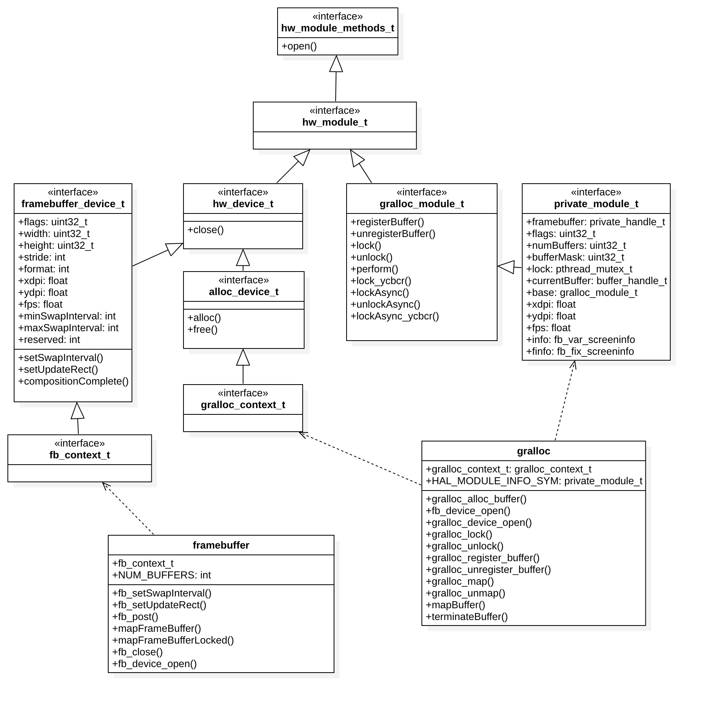

Hardware很多代码用C With Class实现，所以这里用类图来表示关系以便理解。

####HAL层的工作步骤:  
1. 分配一个匹配屏幕大小的图形缓冲区（帧缓冲区/内存中分配）
2. 将分配好的图形缓冲区注册（映射）到当前进程的地址空间来
3. 将画面内容Buffer写入到已经注册的图形缓冲区，并且拷贝到系统帧缓冲中去

####代码体现：
1. 加载Gralloc模块,Gralloc模块包含gralloc和fb设备
2. 打开Gralloc模块中的gralloc设备和fb设备，gralloc负责分配缓冲区，fb负责渲染/操作缓冲区
3. 通过FBIOPUT_VSCREENINFO将渲染好的缓冲区拷贝到系统缓冲区
